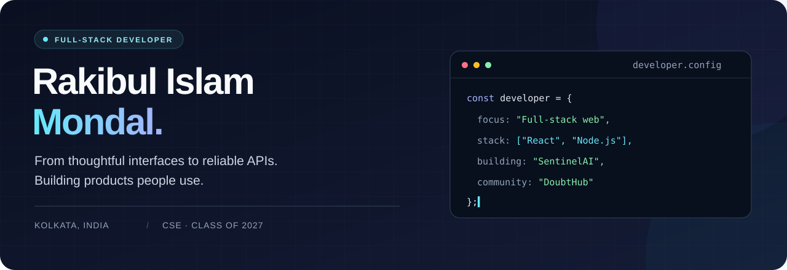

<div align="center">



**React interfaces. Node.js APIs. Products people use.**

Full-Stack Web Developer · CSE Undergraduate · Kolkata, India

[](https://rakibulislammondal.in/)
[](https://www.linkedin.com/in/rakibul-islam-mondal-4350b8287/)
[](mailto:rakibul25cse@gmail.com)

[About](#about) · [Projects](#selected-projects) · [Stack](#technology-stack) · [Activity](#github-activity) · [Leadership](#beyond-the-code) · [Connect](#lets-connect)

</div>

---

## About

I'm **Rakibul Islam Mondal**, a full-stack developer and fourth-year Computer Science & Engineering undergraduate at **Cooch Behar Government Engineering College**. I build and ship web applications with React, Node.js, MongoDB, and PostgreSQL—from the interface and authentication flow to APIs, database queries, and deployment.

My work includes **The OnCampus**, a campus-community startup serving **500+ users**, an AI-powered website generator, and **ClusterForge**, a fault-tolerant distributed computing system. I’m also building **SentinelAI**, my ongoing final-year project exploring security telemetry, machine learning, and incident correlation.

| Building for real users | Learning through systems | Growing a developer community |
| :--- | :--- | :--- |
| **500+ users · 250+ daily active users** on The OnCampus | **SentinelAI** · AI-assisted cyber defense, in progress | **President, DoubtHub** · workshops, mentoring, and tech events |

## Selected projects

### 01 / The OnCampus
**A campus-community startup connecting students, clubs, and conversations.**

**Startup · Live platform**

A full-stack social platform with authentication, clubs, posts, comments, and a follow system. Serving **500+ users** and **250+ daily active users**.

- Built cursor-based pagination and infinite scrolling for the feed.
- Optimized feed APIs with MongoDB aggregation, database indexing, and query improvements.
- Used Mongoose transactions, Sharp image compression, and Cloudflare R2/CDN to support efficient content delivery.

`React` `Node.js` `Express` `MongoDB` `Better Auth` `FFmpeg` `Cloudflare R2`

**[Explore The OnCampus ↗](https://cgecsocial.in/)**

---

### 02 / MakeMySite
**Turn a prompt into a responsive website.**

An AI-powered application that generates website layouts and content using LLM APIs, with dynamic component rendering and a real-time preview.

- Integrated the Gemini API for prompt-driven content and layout generation.
- Built backend APIs for generation and state management.
- Connected a React interface to a PostgreSQL data layer through Prisma.

`React` `TypeScript` `Node.js` `Express` `PostgreSQL` `Prisma` `Gemini API` `Better Auth`

**[Try MakeMySite ↗](https://make-my-site.vercel.app/)**

---

### 03 / SentinelAI
**From scattered security logs to investigable incidents.**

**In progress · Final-year project**

An AI-assisted cyber defense and security investigation platform designed to correlate distributed logs, detect suspicious behavior, and score incidents.

- Built a Python telemetry agent with collectors, a parser, a SQLite buffer, and retry handling over HTTPS/TLS.
- Designed a pipeline combining Redis Streams, rule-based detection, Isolation Forest, and incident correlation.
- Working toward distinguishing isolated attacks from chained, multi-stage activity.

```text
Python agent → Ingestion API → Redis Streams
                                    ↓
                         Rules + Isolation Forest
                                    ↓
                           Correlation engine
                                    ↓
                            Scored incidents
```

*Architecture under development.*

`Python` `React` `Tailwind CSS` `Node.js` `Express` `Redis Streams` `PostgreSQL` `scikit-learn`

---

### 04 / ClusterForge
**Fault-tolerant distributed computing, built around a Coordinator and Workers.**

A distributed-systems project in C++, designed to split jobs across multiple machines, coordinate parallel execution, and recover unfinished tasks when a worker fails.

- **Coordinator:** job submission, work-type selection, task splitting, scheduling, worker registration, and result aggregation.
- **Workers:** task execution, resource reporting, heartbeats, and result delivery over TCP/IP using Protocol Buffers.
- **Fault-tolerance design:** heartbeat-based failure detection and reassignment of unfinished tasks to healthy workers.
- **Six planned workloads:** sum/count, prime calculation, parallel array processing, MapReduce word count, distributed log analysis, and graph processing.

```text
Job → Coordinator → Task queue → Workers → Partial results
          ↑                        │             │
          └── Heartbeats / retry ───┘             ↓
                                           Aggregation
```

*Architecture: two applications with shared workload, networking, and concurrency modules.*

`C++` `TCP/IP` `Protocol Buffers` `Multithreading` `CMake` `Linux / Ubuntu` `GoogleTest`

## Technology stack

<p><strong>Languages</strong></p>
<p>
  
  
  
  
  
  
</p>

<p><strong>Frontend</strong></p>
<p>
  
  
  
  
  
  
  
</p>

<p><strong>Backend & data</strong></p>
<p>
  
  
  
  
  
  
  
</p>

<p><strong>Cloud & systems</strong></p>
<p>
  
  
  
  
  
  
  
</p>

| Area | Technologies |
| :--- | :--- |
| **Languages** | JavaScript (ES6+), TypeScript (MakeMySite), Python, C++, C, Java |
| **Frontend** | React, Next.js, HTML5, CSS3, Tailwind CSS, Bootstrap, Sass, Framer Motion |
| **Backend & authentication** | Node.js, Express, REST APIs, Socket.io, JWT, Better Auth |
| **Databases & ORM** | PostgreSQL, MongoDB, MySQL, Oracle Database, Prisma |
| **Cloud & tooling** | Docker, AWS, Cloudflare R2/CDN, Git, GitHub |
| **Machine learning** | NumPy, Pandas, Matplotlib, seaborn, scikit-learn, regression basics |
| **Distributed systems (ClusterForge)** | C++, TCP/IP sockets, Protocol Buffers, multithreading, CMake, Linux/Ubuntu, GoogleTest |
| **Foundations** | Data structures & algorithms, OOP, DBMS, operating systems, computer networks |

## GitHub activity

<div align="center">

  <a href="https://github.com/Rakibul440">
    
  </a>
  <a href="https://github.com/Rakibul440?tab=repositories">
    
  </a>

### Contribution streak

  <a href="https://github.com/Rakibul440">
    
  </a>

### Recent contribution graph

  <a href="https://github.com/Rakibul440">
    
  </a>

### Annual contribution calendar

  <a href="https://github.com/Rakibul440?tab=overview">
    
  </a>

<sub>Live GitHub activity · Cards refresh through external services. Contributions include more than commits.</sub>

</div>

## Beyond the code

**President · DoubtHub**  
Lead the college tech club, organize technical initiatives, and run hands-on workshops for juniors on web development, C programming, and core technical skills.

**Organizer & website developer · ByteBurst**  
Helped lead the college tech fest from planning through execution and built its official website for event listings, registrations, and participant information. **[Visit ByteBurst ↗](https://byte-burst.in/)**

## Education & learning

**B.Tech in Computer Science & Engineering · 2023–2027**  
Cooch Behar Government Engineering College, West Bengal · **CGPA: 8.5**

<details>
<summary><strong>Courses & ongoing learning</strong></summary>

- **Complete Web Development Cohort** — 100xDevs by Harkirat Singh · June 2025; MERN, DevOps, and open source.
- **Machine Learning A–Z: AI, Python & R** — ongoing since December 2025.
- **Mastering Data Structures & Algorithms in C/C++** — Udemy; ongoing since March 2024.

</details>

---

## Let's connect

Interested in my projects, web development, or the systems behind them? Let's talk.

**[Portfolio](https://rakibulislammondal.in/)** · **[LinkedIn](https://www.linkedin.com/in/rakibul-islam-mondal-4350b8287/)** · **[rakibul25cse@gmail.com](mailto:rakibul25cse@gmail.com)**

<div align="center">
  <sub>Rakibul Islam Mondal · Build. Learn. Share.</sub>
</div>
